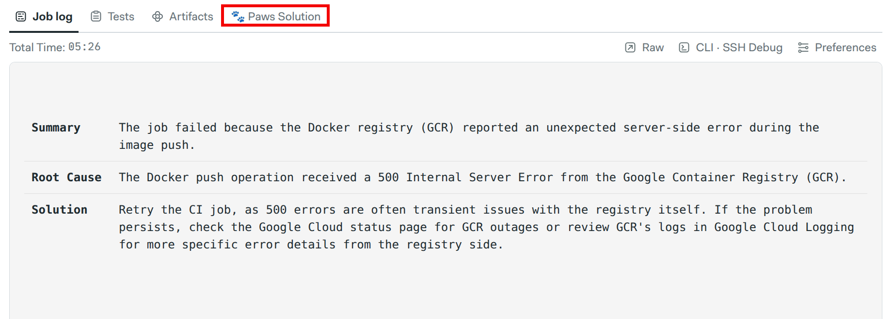
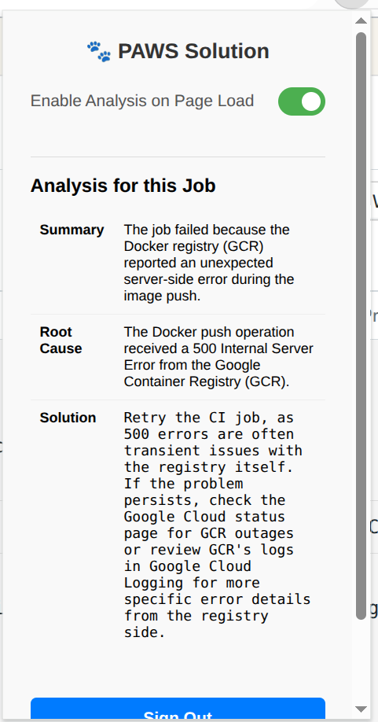

#  PAWS Solution - CI Failure Analyzer


## Description

PAWS Solution is a Chrome extension designed to help developers quickly diagnose failed CI/CD jobs on Semaphore. It reads the log output of a failed job, sends a relevant snippet to the Gemini API for analysis, and displays a concise summary of the root cause and a suggested solution directly on the Semaphore page.

This tool saves developers time by eliminating the need to manually scan through large log files to find the source of an error.

## Usage

Once you enable the extension, on a failed Semaphore CI job page, you'll see an extra tab show up. Clicking on that will show the AI-generated analysis.


You can also click on the extension's icon in the Chrome toolbar to see the analysis in a popup.


## How It Works: Gemini Integration

1.  **Log Analysis:** The extension automatically fetches the full log file of a failed Semaphore job.
2.  **Smart Snippet Extraction:** It uses a series of heuristics to find the most relevant error snippet from the log, filtering out common noise like warnings and help text.
3.  **Gemini API Call:** This small, targeted log snippet is sent to the Gemini API with a prompt asking for a root cause analysis and a suggested solution.
4.  **Display Results:** The structured JSON response from Gemini is then formatted and displayed.


## How to Build

This project is built using TypeScript and requires a build step to compile the TypeScript files into JavaScript.

1.  **Install Dependencies:**
    Navigate to the project's root directory and install the required packages using `npm`.

    ```
    npm install
    ```

2.  **Set Project ID**

    Replace `PROJECT_ID_PLACEHOLDER` in [background.ts](src/background.ts) with our project ID.

3.  **Build the Extension:**
    Run the build command. This will compile the TypeScript files (`.ts`) into JavaScript (`.js`) and place them in a `dist` directory, ready to be loaded by Chrome.

    ```
    npm run build
    ```

## How to Load in Dev Mode

To test the extension locally, you can load it into Chrome as an "unpacked extension."

1.  Open Google Chrome and navigate to the extensions page by typing `chrome://extensions` in the address bar.
2.  Enable **"Developer mode"** using the toggle switch in the top-right corner of the page.
3.  Click the **"Load unpacked"** button that appears.
4.  In the file selection dialog, navigate to your project's directory and select the `dist` folder.
5.  The "PAWS Solution" extension will now appear in your list of extensions and be active in your browser.

### Setting Up for OAuth

**Important:** The OAuth Client ID in `manifest.json` is tied to a specific Chrome Extension ID. When you load an extension in developer mode, Chrome generates a unique ID for it on your machine.

For you to use the "Sign in with Google" feature, you must:

1.  Load the extension locally and find your unique Extension ID on the `chrome://extensions` page.
2.  Provide this ID to the Google Cloud project owner.
3.  The project owner will then need to add your Extension ID to the authorized list in the Google Cloud Console. This is usually done by:
    * Navigating to the [**Credentials page**](https://console.cloud.google.com/apis/credentials).
    * Editing the [**OAuth 2.0 Client ID**](https://console.cloud.google.com/apis/credentials) for this project.
    * Adding your Extension ID to the list of authorized applications.
